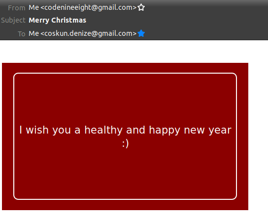
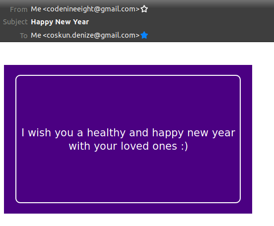
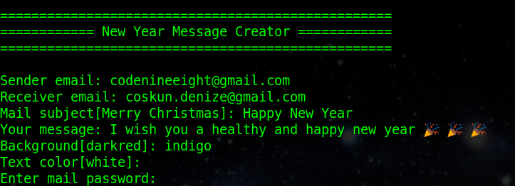

new-year-message-automator
==========================

A command line program to prepare and send an html formatted message card with Python.


Requirements
------------

* Using pip

```
python -m venv env
source env/bin/activate
pip install -r requirements.txt
```

* Using pipenv

```
pipenv install
pipenv shell
```

Usage
-----

```
usage: new_year_message_automator.py [-h] [-f FROMADDR] [-t TOADDR] [-s SUBJECT] [-m MESSAGE] [-b BACKGROUND] [-c TEXTCOLOR]

optional arguments:
  -h, --help            show this help message and exit
  -f FROMADDR, --fromaddr FROMADDR
                        Sender mail address
  -t TOADDR, --toaddr TOADDR
                        Receiver mail address(es). For multiple emails give comma separated emails or a file with an email per line
  -s SUBJECT, --subject SUBJECT
                        Mail subject
  -m MESSAGE, --message MESSAGE
                        Message to send
  -b BACKGROUND, --background BACKGROUND
                        Background color by name or color code without # sign
  -c TEXTCOLOR, --textcolor TEXTCOLOR
                        Message text color
```

Examples
--------

* Using parameters with default subject, background, and text color

```
python new_year_message_automator.py -f codenineeight@gmail.com -t coskun.denize@gmail.com -m "I wish you a healthy and happy new year :)"
```



* Using parameters with custom subject and background color

```
python new_year_message_automator.py -f codenineeight@gmail.com -t coskun.denize@gmail.com -m "I wish you a healthy and happy new year with your loved ones :)" -s "Happy New Year" -b indigo
```



* Interactive with default text color




